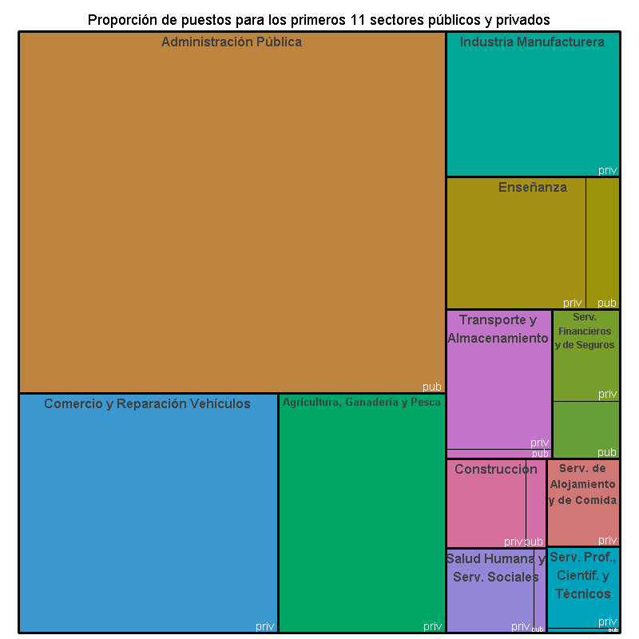

# Análisis de Empleo en Trenque Lauquen, Provincia de Buenos Aires, Argentina

Este repositorio contiene un análisis de datos sobre la evolución del empleo en Trenque Lauquen y su impacto en la región noroeste de la provincia de Buenos Aires. El análisis se basa en datos proporcionados por el Centro de Estudios para la Producción (CEP XXI) de Argentina.

## Resultados Destacados

En este análisis, identificamos los cinco principales sectores privados que han contribuido significativamente al empleo en Trenque Lauquen en la última década. Los resultados muestran...

Más allá de los cinco primeros sectores, analizamos los sectores del 6 al 11 que han experimentado variaciones significativas en el empleo. Esto proporciona una visión más amplia de la dinámica económica en la región.

### Proporción de Puestos por Sectores en 2023

El gráfico treemap muestra la proporción de puestos de trabajo en los primeros 11 sectores, tanto del ámbito público como privado, en el distrito para el año 2023. Este análisis detallado ayuda a comprender la distribución del empleo en la región.

## Cómo Contribuir

Si estás interesado en contribuir a este proyecto o explorar más a fondo los datos y resultados, ¡estás invitado a colaborar! Siéntete libre de abrir problemas (issues) o enviar solicitudes de extracción (pull requests) para sugerir mejoras, correcciones o ampliaciones en el análisis.

## Agradecimientos

Agradecemos al Centro de Estudios para la Producción (CEP XXI) por proporcionar los datos y herramientas necesarios para este análisis, y a la comunidad de datos en Argentina por su apoyo.

¡Esperamos que este análisis sea útil y que fomente una comprensión más profunda de la economía y el empleo en Trenque Lauquen y su región!

---

**Científico de Datos**: [Carlos Marcos](https://github.com/tu-usuario)

**LinkedIn**: [carloseduardomarcos](https://www.linkedin.com/in/carloseduardomarcos/)

**Twitter**: [@Carlos_Marcos](https://twitter.com/_Carlos_Marcos)

